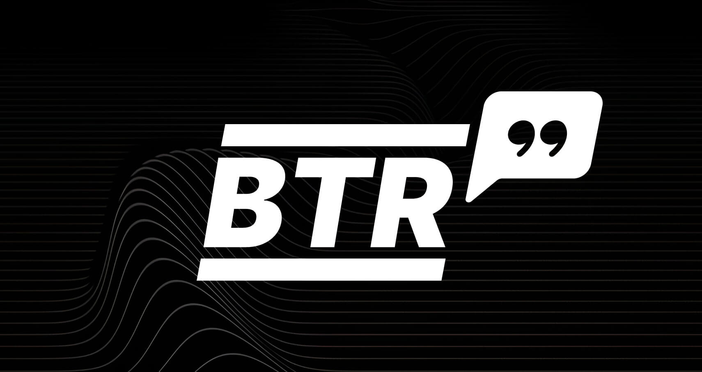

<div align="center">
  
  <!-- <h1>Chomp</h1> -->
  <p>
    <a href="https://t.me/btrsupply"></a>
    <a href="https://x.com/BtrSupply"></a>
    <!-- <a href="https://docs.astrolab.fi"></a> -->
    <a href="https://opensource.org/licenses/MIT"></a>
  </p>
  <p>
    <strong>by <a href="https://btr.supply">BTR Supply</a> & friends</strong>
  </p>
</div>

A Telegram bot [@BtrMarketsBot](https://t.me/BtrMarketsBot) that demonstrates the capabilities of the [BTR Markets API](https://api.btr.markets) for asset price discovery, conversions, and statistical analysis.

## Overview

This bot provides an interface to query price data and perform conversions between various crypto assets, with a focus on both liquid and illiquid tokens. It leverages the BTR Markets API to aggregate price data from multiple sources:
- 50+ CEXs
- 40+ DEXs
- 2000+ liquidity pools
- 30+ Stablecoins

## Features

| Command | Description |
|---------|-------------|
| `/price <token>` | Get mark prices for a token from various sources |
| `/convert <token1> <token2> [amount]` | Convert between tokens using mark prices |
| `/pegcheck <token1> <token2>` | Check if stablecoins maintain their peg |
| `/liqinfo <token.origin>` | Get details about a specific liquidity pool or CEX |
| `/liqmap <token>` | View token's on-chain and off-chain liquidity (WIP) |
| `/oprange <token1> <token2>` | Estimate optimal Concentrated Liquidity range (WIP) |
| `/tokens` | List all available tokens |
| `/help` | Display usage instructions |

## Technical Details

The bot interfaces with the BTR Markets API endpoints to provide several key features:

- Mark price aggregation across multiple sources:
  - Aggregates prices from both CEX and DEX sources
  - Provides weighted average mark prices
  - Endpoint: `/last/{token}`

- Rate conversion for both major and long-tail assets:
  - Converts between any supported token pair
  - Handles illiquid and long-tail assets
  - Endpoint: `/convert/{base}-{quote}?base_amount={amount}`

- Liquidity source tracking and analysis:
  - Maps available liquidity across venues
  - Analyzes depth and spreads
  - Provides pool/venue specific details

- Stablecoin and LSD peg monitoring:
  - Tracks peg deviation between stablecoins and LSDs
  - Alerts on significant deviations
  - Endpoint: `/pegcheck/{base}-{quote}`

## Running the Bot

### Docker Instructions
The bot can be run using Docker:

1. Clone the repository
2. Run the docker setup script:
```bash
cd ./scripts
sudo bash ./setup.bash
```

### Manual Instructions

1. Clone the repository
2. Install dependencies
```bash
uv venv
uv sync
```

3. Run the bot:
```bash
uv run bot/main.py
```

## Contributing

Contributions are welcome! Please feel free to submit a PR.

## License

This project is licensed under the MIT License - see the [LICENSE](LICENSE) file for details.
